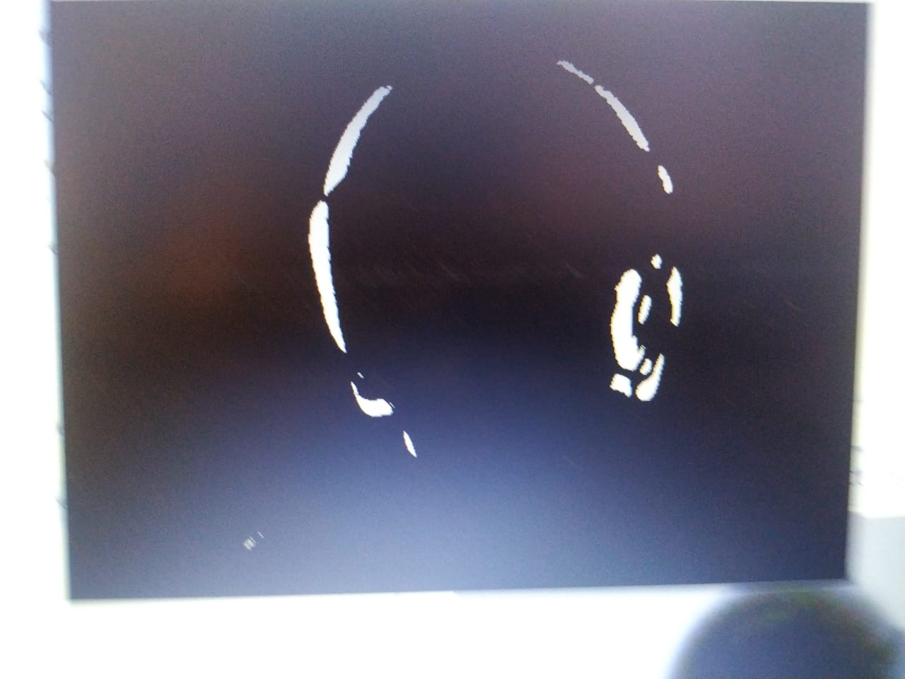
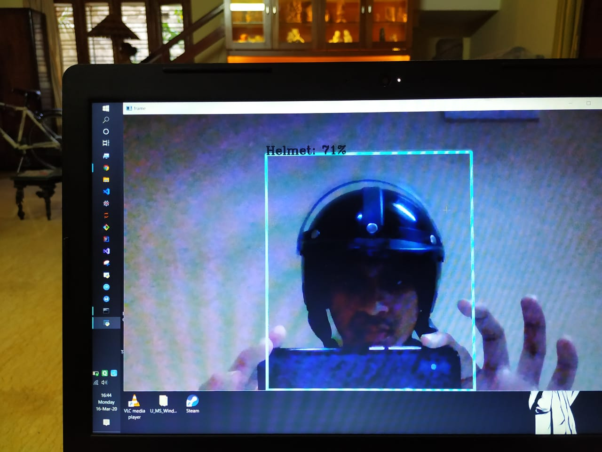
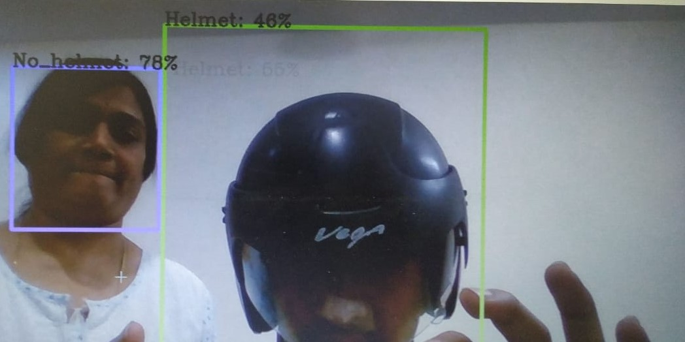
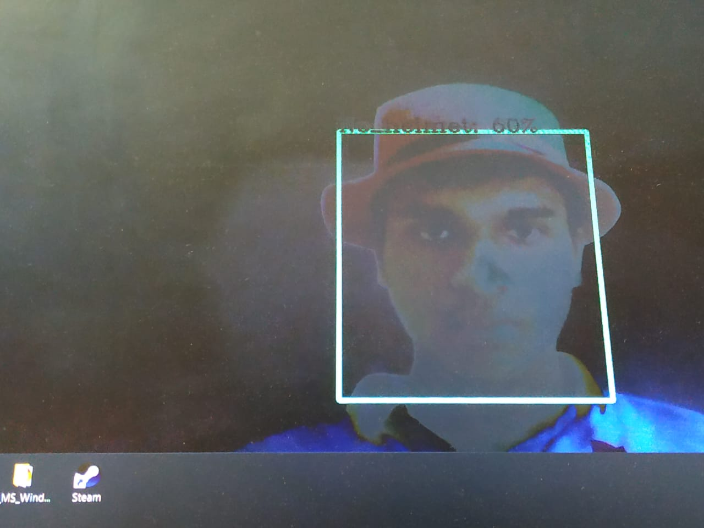

# Automated Helmet Detection 

## Getting started

* Fork the darkflow_master [repo](https://github.com/thtrieu/darkflow)

* You can choose _one_ of the following three ways to get started with darkflow.

1. Just build the Cython extensions in place. NOTE: If installing this way you will have to use `./flow` in the cloned darkflow directory instead of `flow` as darkflow is not installed globally.
    ```
    python3 setup.py build_ext --inplace
    ```

2. Let pip install darkflow globally in dev mode (still globally accessible, but changes to the code immediately take effect)
    ```
    pip install -e .
    ```

3. Install with pip globally
    ```
    pip install .
    ```

## Obtaining the required weights and config file 

First, let's take a closer look at one of a very useful option `--load`

```bash
# 1. Load tiny-yolo.weights
flow --model cfg/tiny-yolo.cfg --load bin/tiny-yolo.weights
```
* [Weight file](https://drive.google.com/file/d/1cEvqlN_OGS4AR_Vxu6AFoTHaBy294aJJ/view)

```
# 2. To completely initialize a model, leave the --load option
flow --model cfg/yolo-new.cfg
```

* [Config file](https://drive.google.com/file/d/1oH9f94nYlnkT15amplhPv9uOTWZjamIS/view)

```
# 3. It is useful to reuse the first identical layers of tiny for `yolo-new`
flow --model cfg/yolo-new.cfg --load bin/tiny-yolo.weights
# this will print out which layers are reused, which are initialized 
```

Sample input images from default folder `sample_imgs/` are flowed through the net and predictions are relayed through live video out for a real-time webcam input or the confidence in case of image input. We can always specify more parameters for such forward passes, such as detection threshold, batch size, images folder, etc.

 - labels: labels used for classification
 - confidence: somewhere between 40 to 60 (how confident yolo is about that detection)
 - [x] correct classification in case of exceptional cases like a hard-hat,kepi/shako


### Training on your own dataset

*The steps below assumes tiny YOLO is used on dataset having 2 classes*

1. Create a copy of the configuration file `tiny-yolo-voc.cfg` and rename it according to your preference `tiny-yolo-voc-3c.cfg` (It is crucial that you leave the original `tiny-yolo-voc.cfg` file unchanged, see below for explanation).

2. In `tiny-yolo-voc-3c.cfg`, change classes in the [region] layer (the last layer) to the number of classes you are going to train for. In our case, classes are set to 2.
    
    ```python
    ...

    [region]
    anchors = 1.08,1.19,  3.42,4.41,  6.63,11.38,  9.42,5.11,  16.62,10.52
    bias_match=1
    classes=2
    coords=4
    num=5
    softmax=1
    
    ...
    ```

3. In `tiny-yolo-voc-3c.cfg`, change filters in the [convolutional] layer (the second to last layer) to num * (classes + 5). In our case, num is 5 and classes are 3 so 5 * (2 + 5) = 35 therefore filters are set to 35.
    
    ```python
    ...

    [convolutional]
    size=1
    stride=1
    pad=1
    filters=35
    activation=linear

    [region]
    anchors = 1.08,1.19,  3.42,4.41,  6.63,11.38,  9.42,5.11,  16.62,10.52
    
    ...
    ```

4. Change `labels.txt` to include the label(s) you want to train on (number of labels should be the same as the number of classes you set in `tiny-yolo-voc-3c.cfg` file). In our case, `labels.txt` will contain 2 labels.

    ```
    Helmet
    No_Helmet
    ```
5. Reference the `tiny-yolo-voc-3c.cfg` model when you train.

    `flow --model cfg/tiny-yolo-voc-3c.cfg --load bin/tiny-yolo-voc.weights --train --annotation train/Annotations --dataset train/Images`


* Why should I leave the original `tiny-yolo-voc.cfg` file unchanged?
    
    When darkflow sees you are loading `tiny-yolo-voc.weights` it will look for `tiny-yolo-voc.cfg` in your cfg/ folder and compare that configuration file to the new one you have set with `--model cfg/tiny-yolo-voc-3c.cfg`. In this case, every layer will have the same exact number of weights except for the last two, so it will load the weights into all layers up to the last two because they now contain different number of weights.


## Camera/video file demo

For a demo that entirely runs on the CPU:

* the options field is set to default to CPU environment
* the `options` field in `video.py` can be appropriately set (recommended 0.7)
* To use your webcam/camera, simply replace self.offset variable in `video.py` with the `(expected offset-found offset)`

## Inference
* Thresholding

* Single Activation

* Multiple contrast Activations

* Exceptional Activation 

That's all.
